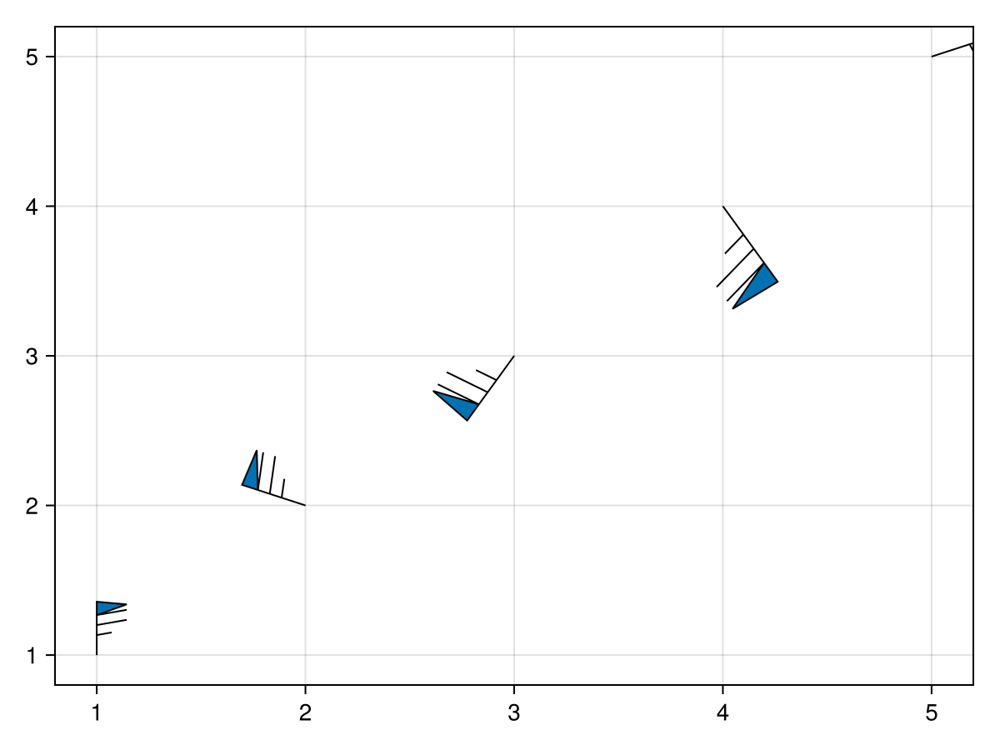
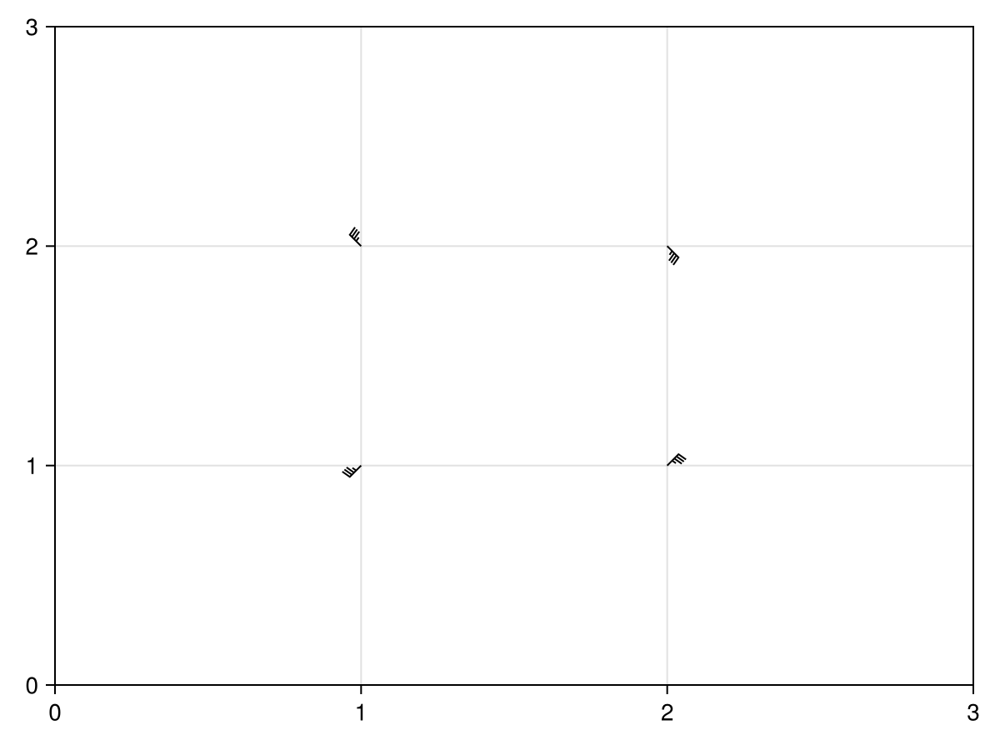
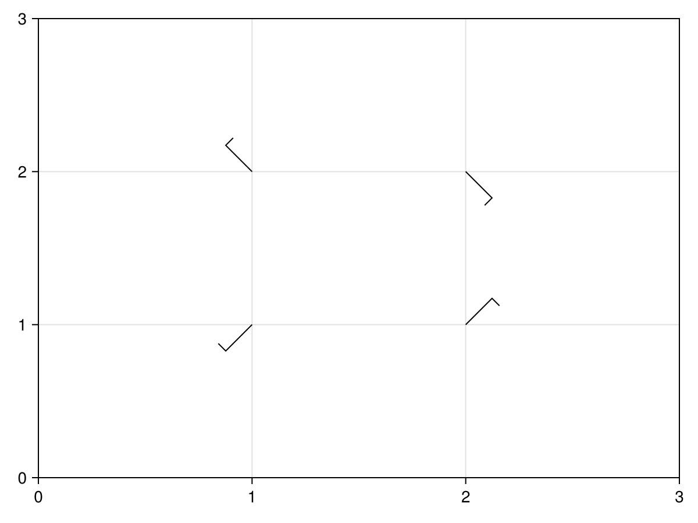

# WindBarbs.jl
Draw wind barbs using Makie.scatter!

```julia
include("WindBarbs.jl/wind-barbs.jl")
using .WindBarbs
```

```julia
windpath = BezierPath(wind_path(30))

p = scatter(1:5,
    marker=windpath,
    markersize=range(1, 2, length=5),
    rotations=range(0, 2pi, length=6)[1:end-1],

    # color=:transparent, 
    strokecolor=:black, strokewidth=1
)

save("scatter-path.png", p)
```


```julia
scatter_wind2(xs=1:2, ys=1:2, us=[1 1; -1 -1], vs=[1 -1; -1 1], filename="scatter-path2.png")
```


```julia
scatter_wind(xs=[1, 1, 2, 2], ys=[1, 2, 1, 2], us=[1, 1, -1, -1], vs=[1, -1, -1, 1], filename="scatter-path3.png")
```

